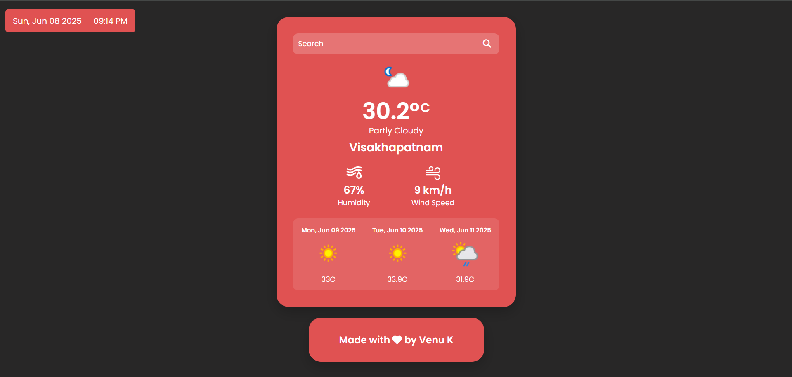
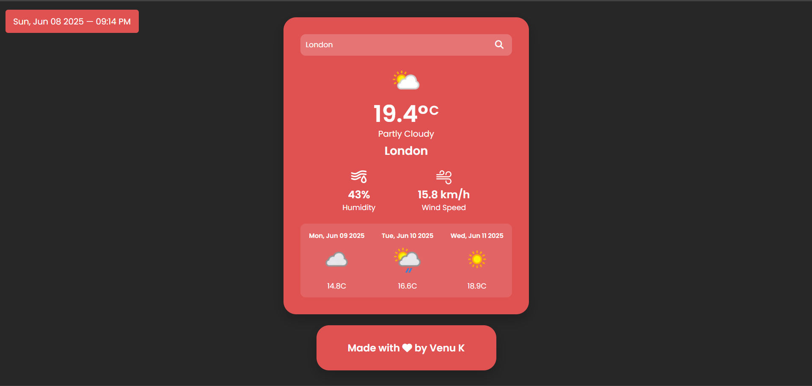
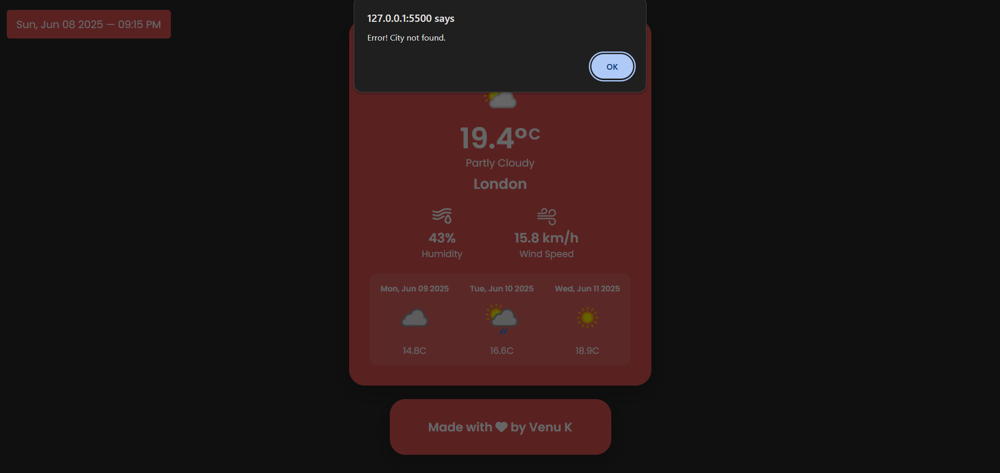

# Weather App

## Overview
This is a simple weather application built using HTML, CSS, and JavaScript. It fetches real-time weather data and a 3-day forecast for a user-specified city using the WeatherAPI. The app features a clean, modern UI with a search bar, current weather details, and a forecast section.

## Features
- **Current Weather**: Displays temperature, weather condition, humidity, and wind speed for the searched city.
- **3-Day Forecast**: Shows weather predictions for the next three days, including temperature and condition icons.
- **Dynamic Date and Time**: Updates the current date and time every second.
- **Responsive Design**: Optimized for various screen sizes with a centered layout.
- **Search Functionality**: Allows users to search for weather by city name, with a default city (Visakhapatnam) if no input is provided.

## Technologies Used
- **HTML**: Structure of the web page.
- **CSS**: Styling with Poppins font and Font Awesome icons for a polished look.
- **JavaScript**: Handles API requests, DOM manipulation, and dynamic updates.
- **WeatherAPI**: Provides weather data via the `forecast.json` endpoint.
- **External Libraries**:
  - [Font Awesome](https://fontawesome.com/) for icons.
  - [Google Fonts](https://fonts.google.com/) for Poppins font.

## File Structure
- `index.html`: Main HTML file containing the app's structure.
- `styles.css`: CSS file for styling the app.
- `app.js`: JavaScript file for fetching and displaying weather data.
- `config.js`: Stores the WeatherAPI key (not included in the repository for security).
- `imgs/`: Folder containing humidity and wind speed icons (`humidity.svg`, `wind.svg` , `main-interface.png`,`search-functionality.png`,`error-handling.png`).

## Setup Instructions
1. **Clone the Repository**:
   ```bash
   git clone https://github.com/your-username/weather-app.git
   cd weather-app
   ```

2. **Obtain a WeatherAPI Key**:
   - Sign up at [WeatherAPI](https://www.weatherapi.com/) to get an API key.
   - Create a `config.js` file in the project root with the following content:
     ```javascript
     export const API_KEY = 'your-api-key-here';
     ```

3. **Serve the Application**:
   - Use a local server (e.g., Live Server in VS Code or `http-server`) to run the app, as it uses ES modules (`type="module"`).
   - Example using `http-server`:
     ```bash
     npm install -g http-server
     http-server .
     ```
   - Open your browser and navigate to `http://localhost:8080`.

4. **Usage**:
   - Enter a city name in the search bar and click the search button or press Enter.
   - View the current weather and 3-day forecast for the specified city.
   - If no city is entered, the app defaults to Visakhapatnam.

## Screenshots
Below are screenshots showcasing the Weather App's interface:

- **Main Interface**: Displays the current weather and forecast for Visakhapatnam.
  

- **Search Functionality**: Shows the search bar with a city name entered.
  

- **Error Handling**: Displays an alert when an invalid city is searched.
  

## Dependencies
- Internet connection for fetching weather data and external resources (Font Awesome, Google Fonts).
- A modern browser supporting ES modules.

## Notes
- The app uses the WeatherAPI's `forecast.json` endpoint to retrieve current weather and forecast data for up to 4 days.
- Error handling is implemented to alert users if the city is not found or if there’s an issue fetching data.
- The date and time update every second using `setInterval`.
- The app is styled with a dark theme and a vibrant accent color (`hsl(0, 70%, 60%)`).

## Credits
- Made with ❤️ by [V Rohith](https://github.com/Rohith0232).
- Weather data provided by [WeatherAPI](https://www.weatherapi.com/).
- Icons from [Font Awesome](https://fontawesome.com/).
- Font from [Google Fonts](https://fonts.google.com/).

## License
This project is licensed under the MIT License. See the [LICENSE](LICENSE) file for details.